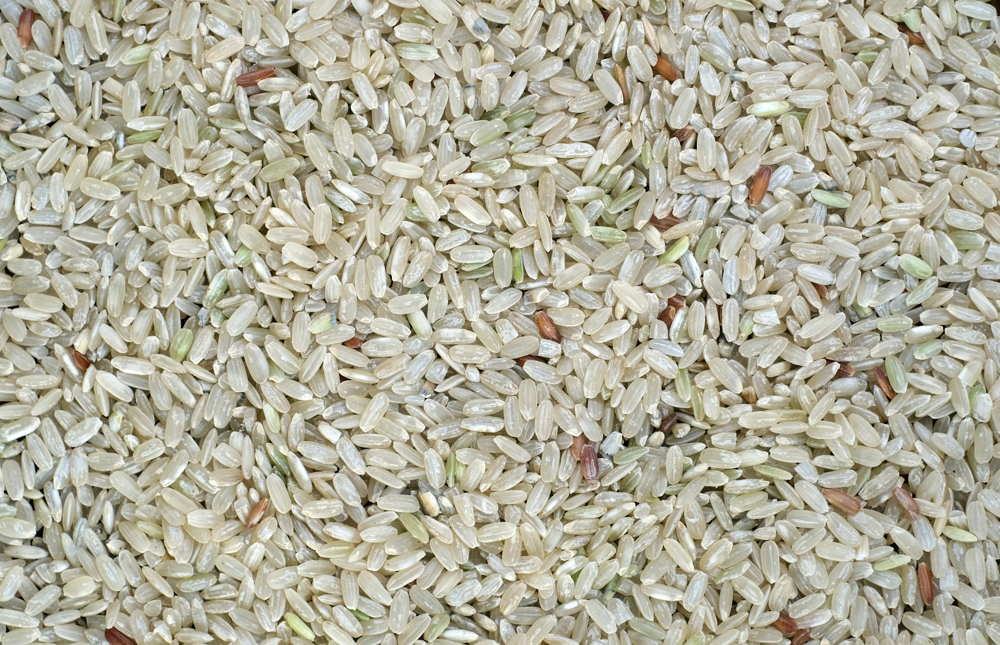
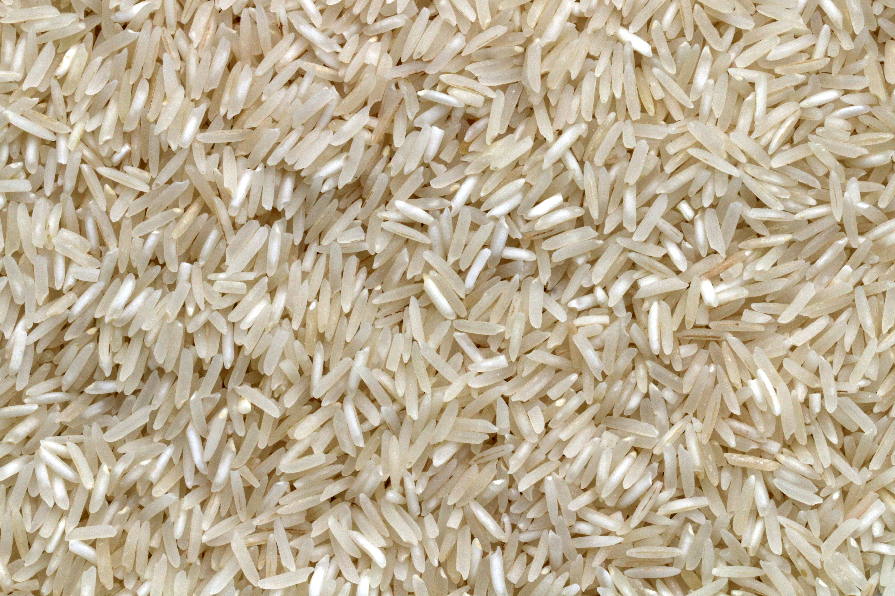
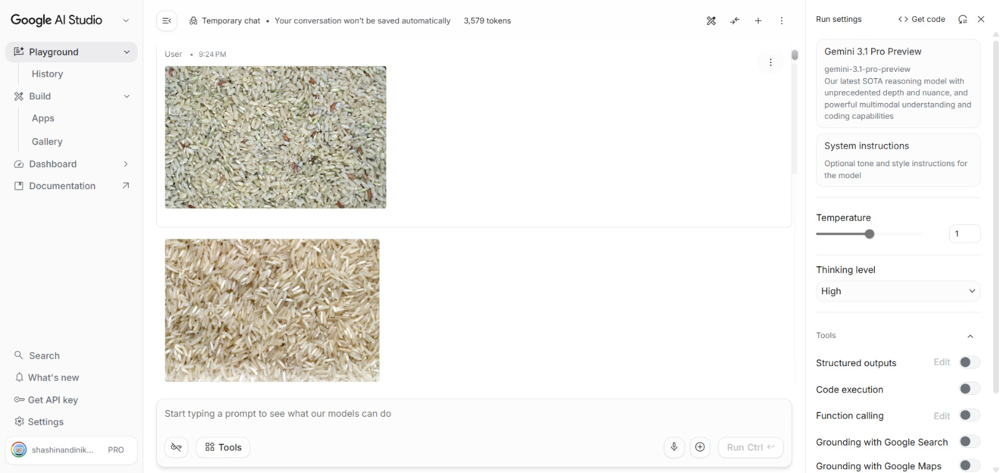
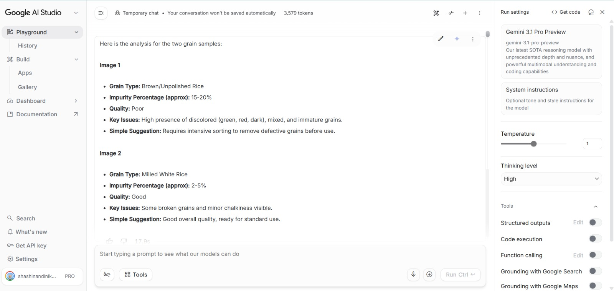

# 🌾 SmartGrain AI

An AI-powered grain quality analysis system that helps users detect impurities and assess grain quality using image input.

---

## 🚨 Problem Statement

In rural households, grain cleaning is done manually using traditional methods like sieving. This process is time-consuming and often fails to detect small impurities such as stones, dust, and broken grains.

---

## 💡 Solution

SmartGrain AI allows users to upload an image of grains and uses AI (Gemini) to:
- Identify grain type
- Detect impurities
- Estimate impurity percentage
- Provide quality rating and suggestions

---

## ⚙️ Features

- 📷 Image-based grain analysis  
- 🌾 Multi-grain detection (rice, wheat, etc.)  
- ⚠️ Impurity detection (stones, dust, broken grains)  
- 📊 Impurity percentage estimation  
- ⭐ Quality grading (Good / Average / Poor)  
- 💡 Simple cleaning suggestions  

---

## 🧠 How It Works

1. User uploads an image of grains  
2. Image is analyzed using Gemini AI  
3. AI detects grain type and impurities  
4. System outputs quality, impurity %, and suggestions  

---

## 🛠️ Technologies Used

- Google Gemini (AI Model)  
- Google AI Studio  
- HTML, CSS, JavaScript  
- GitHub Pages (Deployment)  

---

## 🌐 Live Demo (MVP)

👉 https://arthireddy14.github.io/smartgrain-ai/

---

## 🎥 Demo Video

👉 https://youtu.be/jEM8jY9pFs0

---

## 📸 Screenshots

### Input Screen

### AI Analysis

### Output Screen

---

## 🚀 Future Scope

- Mobile app development  
- Real-time camera scanning  
- Improved AI accuracy  
- Low-cost hardware integration  
- Automated grain sorting system  

---

## 👤 Author

Chinninti Arthi Reddy
